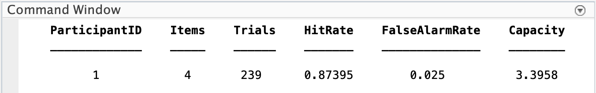

# Visual Working Memory Capacity <a href="https://github.com/mrvnthss/visual-working-memory-capacity"></a>

[![MATLAB](https://img.shields.io/badge/MATLAB-2023a-006d9b.svg?logo=data:image/png;base64,iVBORw0KGgoAAAANSUhEUgAAAEAAAABACAYAAACqaXHeAAAABGdBTUEAALGPC/xhBQAAACBjSFJNAAB6JgAAgIQAAPoAAACA6AAAdTAAAOpgAAA6mAAAF3CculE8AAAAhGVYSWZNTQAqAAAACAAFARIAAwAAAAEAAQAAARoABQAAAAEAAABKARsABQAAAAEAAABSASgAAwAAAAEAAgAAh2kABAAAAAEAAABaAAAAAAAAAEgAAAABAAAASAAAAAEAA6ABAAMAAAABAAEAAKACAAQAAAABAAAAQKADAAQAAAABAAAAQAAAAAC1ay+zAAAACXBIWXMAAAsTAAALEwEAmpwYAAACymlUWHRYTUw6Y29tLmFkb2JlLnhtcAAAAAAAPHg6eG1wbWV0YSB4bWxuczp4PSJhZG9iZTpuczptZXRhLyIgeDp4bXB0az0iWE1QIENvcmUgNi4wLjAiPgogICA8cmRmOlJERiB4bWxuczpyZGY9Imh0dHA6Ly93d3cudzMub3JnLzE5OTkvMDIvMjItcmRmLXN5bnRheC1ucyMiPgogICAgICA8cmRmOkRlc2NyaXB0aW9uIHJkZjphYm91dD0iIgogICAgICAgICAgICB4bWxuczp0aWZmPSJodHRwOi8vbnMuYWRvYmUuY29tL3RpZmYvMS4wLyIKICAgICAgICAgICAgeG1sbnM6ZXhpZj0iaHR0cDovL25zLmFkb2JlLmNvbS9leGlmLzEuMC8iPgogICAgICAgICA8dGlmZjpZUmVzb2x1dGlvbj43MjwvdGlmZjpZUmVzb2x1dGlvbj4KICAgICAgICAgPHRpZmY6UmVzb2x1dGlvblVuaXQ+MjwvdGlmZjpSZXNvbHV0aW9uVW5pdD4KICAgICAgICAgPHRpZmY6WFJlc29sdXRpb24+NzI8L3RpZmY6WFJlc29sdXRpb24+CiAgICAgICAgIDx0aWZmOk9yaWVudGF0aW9uPjE8L3RpZmY6T3JpZW50YXRpb24+CiAgICAgICAgIDxleGlmOlBpeGVsWERpbWVuc2lvbj4yNTY8L2V4aWY6UGl4ZWxYRGltZW5zaW9uPgogICAgICAgICA8ZXhpZjpDb2xvclNwYWNlPjE8L2V4aWY6Q29sb3JTcGFjZT4KICAgICAgICAgPGV4aWY6UGl4ZWxZRGltZW5zaW9uPjI1NjwvZXhpZjpQaXhlbFlEaW1lbnNpb24+CiAgICAgIDwvcmRmOkRlc2NyaXB0aW9uPgogICA8L3JkZjpSREY+CjwveDp4bXBtZXRhPgrkVyGCAAAHi0lEQVR4AeWbW6iVRRTHPR7NJIzootCTFiVesKwgswy6CEVWUhFWXoJECsKghyDyoR6rp54qKEWMLgQRPQRBhEJgD2UEgSBY+ZBRhIlJ1vFy+v3nm/+c2bfv7H323mdfXPD/1nwz882s/5q15rucfWbMOM9lpN/5j4+Py8ZR2zkyMnLG5aHXkXwFT9XVq6/oNAwnkJxpHpS3gp1gc1aX2l03NBqiKTUpfwZy+cREqUz9XDcUGmIh59G7gORfMAb+0wmyS0TRaW8YCuKR1KyoNwaqBfFYDEqOkDyW9x8KB0Aq5DV6PvgLSM4WKh19fpSaedEJw5EKEPLqfxDperUT+6r6V4YmCjLy6yPJM9Wss/NzsXwMffnARwEkHPrzKP8ayTnU42mNcnTsGPgogJpDf3ekaXI1rLMKO+gIdXMHNgowfnY0fkMkVxb6Gf9QPB0rNg1kFGC8V34R5ZORjFc2npYqO2tfdMDgPB1Cy3mvZ/vvI02vaCnrqkZviCun4oSeeAwCmndcBiMfg+vBaRAiAt2KnI2dN0bdE05NGwz59PhK+c24ms1serFrjXLK/EJLf26GGKYwHwVhw5O3KL8LJFMJ++LKiaP3ggfj2MnJTa9MNzpin4hXhDXnC8FeIOkE+XycD/vGAViVcpGyHnDWgNfAP0DSTtgXI0wcvRHq/WF+dELv3g8wIq065ReBXlxy6dTK1xvzyeiAZIPOp02wKEyMvgx8nVmoPBVxr1bW1JGi94HPRZYRm9oHOhomTDpLHy3RC7BhP1gExoCcklKCcjdEt1XxOQWWYMcR7JiJPlc2WceMipOJ/EVMuA+Y/AWUOzZPCRmR1xdj3Qrvi/0mnXfSDnGgUgVpHJ08/SmdFwOtvMhPp8gJkocLNaN09dWnbQdo5RnHLzRvUL4b9II80yY+t2HX1VqUaJ/a6sqUHcDAerAZ1SRAt7QtzLAdKAyne+VNzmmg+e+PlaUcSxs9qjUk04MNpM8K1C0Gr9Pnndivqd3XY3ZBt5QG7lxqBwTlKO2oWt0g1K2l8Ax4AJi0d+LQp0cH26D8X47NB2U/uu5+UPqwwIWBmFaawZRPl6A3gG0gvH6iJXKM+jblUF3QRXEaiNt6cBBoAes6oMZgSKpOuZ2v9hLqtoKNIDxqouUUebtfiGNKEtkmu76Dx03ihMjWGkkOoFO9ML+HKxTm64D3CzkmOAndz+JUuBHyB+CnRfW3g2T3LDXoLDYqzC/lVH91UZivABYRlxNK08ad+0CLrGx9BBwAabEpJ0mVEF9OrcL8CRC+taP7Ocwxr1SU81qwQ2AZC6ynVFRlKui2po3iWXA78AcLr7bDnqaBFDthLcS/hGtNGoigUuBWIPJ6kXDoDDp5qKSdX1EtSRFfnMYKPHMxFXuA7ukSRcCg5HowuMHBG+Ex2hcTBX9Wp8FMKvQKewLoe9pzQBeJvL7SDrpoxbWY2tgfimTCph/LRUjghBDuOEF3getofB8sBUoHDTLI6SAOIr0ffqtrIoAG3QL1QiPys9E/ULUCvAV0ocjLi4Mq4qDN8Bb4rYYfauJrUcXK0qhPVkoJvejoAUj30BPAKVH3aYr2Xops0gIJWm1riknkAMlThZrYDGt2RXXACaoPj8OUr6T8HrhDTUCDyau5qL7uWHmnLpRFttFmndtq+47TX5vhH+KIFLlfbZgagB4clBJHwZ302QGCY9DaIO1tiqFextjTquumiJDmF/mTYA94GjwOXgBfAdsqu1SW1svco0BSvYhFbfURJ+jDR1hdtDaRn0Au2jv85ynVy3HdlHz8nUykCK0R6mXrN9EQXeNP8d+qM+eBU82F9SrUGfiz11zK+g2P/rqzCawAS8E28BuQeLLirHNHk5fTtdpBKOudJrzXWGdtr1JnsV1r1E5lc1GQDdYo30IXBrwC/Bhn82TxtG1l8qcYyQRmU67YyOvZSp8tQCLHSXarH7qUj8eq0FykhydDXnd5Thx0AXXaZCR5ahQ1UzuavJx6c5xH3/1Khb555N7Lue3Rn9Dqpk7pgJM1MmgwCr0OSGx4cTa1o43W1XfJBvSk5HNb6e/0XUP5byB5Pu/TsTIDh7BCf6RZkHZSId9g/ctQv7G2ZDN22Anar46D31saoNnODBxyEn0NMHnnHlUtia9/SfNz5ZTI23Zfj9ZedQhsd1tHNQM7CvwLEBOhqWkZiz13yTjKre3YDRgxjm27kPLmBt3aq2ZgR8G1lE2+lSgw+b22hHGav2/7ogaasTrizAbDF9VMYk/voSyxI4qzxkf3O0wX/xi64wYztu4QdW+hpcSabWTwYDR6FZDku3lRU3s0ef0GeKHmQgdHNjtvX/XDeKfC3si17LZo8gr/GyL5tja9njvDq4f2z2BNMvojKdfLQekpr+cE2jUAMn6JmkP5ZyCpTgX/G8wJ2lYNxcrnjoOUN8OXxR7xakvbGfoD5lVDRz4S8j6wCJL65yeFeX5LfJtzP0IP7oaXr3p1GYKOAj8eywlfgJDv0VEdv9VV29Gzc4g6ClZSViosszGU9UbZsYccj9t3upok53qN7vmqT6vnRZqVEcJn+L5bpfPRoP8BboU5szUawX0AAAAASUVORK5CYII=)](https://www.mathworks.com/)
[![Psychtoolbox](https://img.shields.io/badge/Psychtoolbox_3.0.19-50124e.svg?logo=data:image/png;base64,iVBORw0KGgoAAAANSUhEUgAAACAAAAAgCAYAAABzenr0AAAAAXNSR0IArs4c6QAAAIRlWElmTU0AKgAAAAgABQESAAMAAAABAAEAAAEaAAUAAAABAAAASgEbAAUAAAABAAAAUgEoAAMAAAABAAIAAIdpAAQAAAABAAAAWgAAAAAAAABIAAAAAQAAAEgAAAABAAOgAQADAAAAAQABAACgAgAEAAAAAQAAACCgAwAEAAAAAQAAACAAAAAAX7wP8AAAAAlwSFlzAAALEwAACxMBAJqcGAAAAVlpVFh0WE1MOmNvbS5hZG9iZS54bXAAAAAAADx4OnhtcG1ldGEgeG1sbnM6eD0iYWRvYmU6bnM6bWV0YS8iIHg6eG1wdGs9IlhNUCBDb3JlIDYuMC4wIj4KICAgPHJkZjpSREYgeG1sbnM6cmRmPSJodHRwOi8vd3d3LnczLm9yZy8xOTk5LzAyLzIyLXJkZi1zeW50YXgtbnMjIj4KICAgICAgPHJkZjpEZXNjcmlwdGlvbiByZGY6YWJvdXQ9IiIKICAgICAgICAgICAgeG1sbnM6dGlmZj0iaHR0cDovL25zLmFkb2JlLmNvbS90aWZmLzEuMC8iPgogICAgICAgICA8dGlmZjpPcmllbnRhdGlvbj4xPC90aWZmOk9yaWVudGF0aW9uPgogICAgICA8L3JkZjpEZXNjcmlwdGlvbj4KICAgPC9yZGY6UkRGPgo8L3g6eG1wbWV0YT4KGV7hBwAABRJJREFUWAmtlktsVVUUhk9bKBZKQUHkLcpDVOQ1ACPoxASJxIEjJjjQCCOdOHZi4gTGmpg4QxgYJIRgAoGQQKrRgRKCUbRYqSKWIqIC8mgpl+/b3auce1subfBP/rvWfq/9r733uQ3FKFCpVBpAZbghtlEv7XS3Po20j4H99OnHjhws4MACuwJ+CGfn8gMjn+U+erJgc17wPXyxEj4Jf4UvlKemPBY2levCp16VBqEkdcGAZjiu1Omr7D+GbYFz4ev0aYOfw5eRt0+J8RtgE0zBO642PXUDcALQC28wtpHyfOzTTgTWU38M+xd8Eb4EN8A10FS10u4E5rvXulHBxR2AXQ6fzX47fuC7XPdFrtiKvQo/hUfh9tyuMovhGDgkLUMUoJM7bTR6JwAfwf158JVUUxTu6CnqJmKP57qlWBfwcGpfo30KdjM8CSerBnVVh3YwABrMlwvfkvgTobn/0sFwHXQicR06dgn8HgrPgrl+EB6A4k3Ymbyi+ID5NjC3Y1U2KZwCsAD8ceG1cAZ9VsFrsA2KV+CF5N35WY3blYtTsSrj4fwHutAm2APFRmgQoUC61qFA3HGjOgQ/g/9By9OhEz4Hb0ERkxjAxVRTFOOxl3NbK9bUqNDD8E8oHoKmSqS1zXcTO+/D2rgTOvkiOA32wZnwD7gQmnNvhFILJ4ugTNclK4HjTyWvKBZjz2ZfNddnX7UbjCLlAjsBvpoblfMJqHxzoLt0h6qhL1xYuZ30XzgWqoBYDqOf19arKtphnJmbVkQK9JW5QyfjGex5qITxbhtM7FJ1fIhmQfsJ02YwLhoqPY7vWRJvofZudt6Sz1zFAOK6XcWPa2ZnJ3FCETl3MQ9aGQsonMsVHjyld3Fvhbs0hdYL0yhizTsKEJG7jFwp7zwYCimzAapG5DweFfMdcjtxqLgM3zknwyQ31mBFVQAoMviBOD3QngY4UAqtMnoIY+F0cygrscEJ23+EBjkbqoRpiqAfwRfpO6GTHh5sTNppJbDs7j10Ruu1UnpT4cLmP6DEoZQL/AS7oFABg4h2D62wPh3+aAhbDkDZfNXs6BVzkHBCgwl4fQ1QuGsP5DcWQEjt2fJGeUCrvoixsPXiN2hH4SLR7q6V0QlVIQKIsm++AdvfvoehUEnZzRlTzXdgAuWUllggIj1Da1wz733U288BnmZzGgHgJoVUIc7BTHwDME2O+Rp+C915HFaLCRFAkpcOLrAjcztW+SMIfSUsB5DySN0kGEEtYp5Oyr9A1Xif8l4O+gQY61F9F0Qn7Fzoc3kRirPwBLTudLaYhMv8ns++gfu1exsehF5Hy/dePHdMu2LAJOjiR7L9G7sPeoXOwOswcAOnJxf2OU8Z1HsOhoUS1cL/BQbhu2703v9jcA40BebR74YfJW+HcIGURuw0xo9DdoPyQ1f3L/iQABiQTqezAg+l8m3DPAr3wFXQJ9lg2qBQXgMS3givpeVyYBRHCZWAVbmjfBi6u5NQXBkwlR+y1fg8G7hfyLqomry2J2rEvyT/mnstxc/QibstgAswbsAn+Lug6RNlNQdqan6HpKCmPRUJpNdt5bYOrGckPlze99+hKVpDXw9rOkf4cS5oGh51FagZEn3j03uC9i3wDXgEqtASKNL3fsCt/xuT1u9V3Rq7Os4OP4btNB/IXVZkG32qR95PCVlTsNhW+Dz0ZYs3Yzq+78K7roH1e/H/IxaMmSkPKoi/EM6wDev1GxFuA+nixclANKEgAAAAAElFTkSuQmCC)](https://www.psychtoolbox.net)
[](https://opensource.org/license/mit/)

This repository contains MATLAB (The MathWorks Inc., [2023](#matlab)) code that replicates[^1] a visual working memory capacity experiment by Vogel & Machizawa ([2004](#vogel-machizawa)). This experiment is part of [#EEGManyLabs](https://osf.io/yb3pq/), a large-scale effort by an international collaboration of researchers "to directly test the replicability of key findings from 20 of these [most influential and continually cited] studies [in the field of EEG research] in teams of at least three independent laboratories" (Pavlov et al., [2021](#eeg-manylabs)). The implementation provided here is based on the [Psychtoolbox](http://psychtoolbox.org/) library (Brainard, [1997](#brainard-ptb); Kleiner et al., [2007](#kleiner-ptb); Pelli, [1997](#pelli-ptb)).

[^1]: This solely refers to the psychophysics of the study by Vogel & Machizawa ([2004](#vogel-machizawa)). The source code published here is not intended to be used for an actual EEG study.

## Table of Contents

- [Overview](#overview)
- [Results by Vogel & Machizawa (2004)](#results-by-vogel--machizawa-2004)
- [Getting Started](#getting-started)
- [Configuring the Experiment](#configuring-the-experiment)
- [Data Analysis](#data-analysis)
- [Known Issues](#known-issues)
- [Languages and Tools](#languages-and-tools)
- [References](#references)
- [Acknowledgments](#acknowledgments)
- [License](#license)

## Overview

In their study, Vogel & Machizawa ([2004](#vogel-machizawa)) provide evidence for "**lateralized [brain] activity in humans that reflects the encoding and maintenance of items in visual memory**". Moreover, their study strongly suggests that the amplitude of this neural activity (measured by recording ERPs) serves as a "strong neurophysiological predictor of an individual’s [visual working memory] capacity" (Vogel & Machizawa, [2004](#vogel-machizawa)).

To arrive at these results, Vogel & Machizawa ([2004](#vogel-machizawa)) had their subjects complete the following visual working memory task: On each trial, participants were briefly shown a bilateral array of colored squares. Subjects had to memorize the items from only one of the two hemifields, which was indicated with an arrow prior to the onset of the memory array. After a retention interval spanning 900 ms, "memory was tested (...) with the presentation of a test array that was either identical to the memory array or differed by one colour" (Vogel & Machizawa, [2004](#vogel-machizawa)). To indicate whether the two arrays were identical or different, subjects pressed one of two buttons. This flow of the experiment is summarized in the following figure:

<div align="center">
    
    <p>Schematic flow of a single trial.<br>
    Size of stimuli has been increased for demonstration purposes.</p>
</div>
<br>

Additionally, here is a dynamic preview[^2] of the experiment:

<div align="center">
    
</div>

[^2]: The size of the stimuli has been increased for demonstration purposes.

## Results by Vogel & Machizawa (2004)

The experiments conducted by Vogel & Machizawa ([2004](#vogel-machizawa)) suggest that there is **lateralized activity** (contralateral to the memorized hemifield) **reflecting** "**the maintenance of successful representations in visual memory**". This activity comes in the form of a "large negative-going voltage (. ...) focused primarily over the posterior parietal and lateral occipital electrode sites" with a peak latency of approximately 200 ms (ERPs were time-locked to the onset of the memory array) (Vogel & Machizawa, [2004](#vogel-machizawa)).

The mere presence of the described signal during the experiment does not imply that this contralateral delay activity reflects "the maintenance of successful representations in visual memory" since visual memory performance is driven by numerous processes (Vogel & Machizawa, [2004](#vogel-machizawa)). How then did the authors arrive at their conclusion?

1. By repeating the experiment with different array sizes (1, 2, 3, and 4), Vogel & Machizawa ([2004](#vogel-machizawa)) showed that the "amplitude [of the delay activity] was **highly sensitive to the number of items** in the memory array". Additionally, this amplitude was **significantly larger for correct trials compared to incorrect trials**.

2. In a third experiment, Vogel & Machizawa ([2004](#vogel-machizawa)) had participants complete the same task again; this time with array sizes of 2, 4, and 6 squares. While there was a significant increase in amplitude going from 2 to 4 squares per array, there was no additional increase when increasing the array size further from 4 to 6 squares. Given that a typical individual's memory capacity is right around 3 to 4 items, this implies that the delay activity's **amplitude only increases for larger stimulus arrays below or at an individual's capacity and does not increase any further for supra-capacity arrays**.

3. This finding was further reinforced by yet another experiment in which participants completed the same task again, this time the arrays consisted of 2, 4, 8, and 10 squares each. The finding was identical: While there was a significant increase in amplitude going from 2 to 4 squares per hemifield, no such increase was observed when moving from 4 to either 8 or 10 squares per array (Vogel & Machizawa, [2004](#vogel-machizawa)).

4. The amplitude of the contralateral delay activity initially increases monotonically as the number of squares per array increases.  However, it quickly reaches its maximum at three items per hemifield and then starts to drop off. Notably, the **visual working memory capacity** averaged across participants was "2.8 items, which is approximately when the memory **delay activity** reaches a limit" suggesting that these two measures are **strongly related** (Vogel & Machizawa, [2004](#vogel-machizawa)).

5. Building on this finding, further analysis of the data showed that the increase in amplitude between arrays of 2 and 4 items was "very strongly correlated" with the individual subject's memory capacity, "with low-capacity subjects producing very little amplitude increase and high-capacity subjects showing larger amplitude increases" (Vogel & Machizawa, [2004](#vogel-machizawa)).

## Getting Started

Follow these steps to clone the repository and run the project on your local machine.

### Prerequisites

- MATLAB with Psychtoolbox installed. Visit [Psychtoolbox](http://psychtoolbox.org/) for installation instructions.

### Clone the repository

1. Open a terminal or command prompt on your local machine.

2. Clone the repository using `git`:

```
git clone https://github.com/mrvnthss/visual-working-memory-capacity
```

### Run the Experiment

1. Open MATLAB and navigate to the cloned repository's directory.

2. Run the [`WorkingMemoryCapacity.m`](WorkingMemoryCapacity.m) script to start the experiment.

## Configuring the Experiment

### Setting Experiment Parameters

There are several parameters that can be changed in the [`WorkingMemoryCapacity.m`](WorkingMemoryCapacity.m) script that alter the experiment. They can be found in the *Configuration of Experiment* section close to the top of the script.

#### Experimental Design

- `nSquares`: Controls the number of squares per hemifield in the memory and test arrays. Vogel & Machizawa ([2004](#vogel-machizawa)) conducted multiple experiments with varying numbers of squares (i.e., 1, 2, 3, 4, 6, 8, and 10).

- `nTrials`: Number of trials to be conducted. Vogel & Machizawa ([2004](#vogel-machizawa)) had every subject complete 240 trials in each experiment.

- `nPracticeTrials`: Number of (additional) trials that participants complete to familiarize themselves with the experiment.

#### Timing parameters

- `Duration.stimOnsetAsyncMinSecs`: Parameter (lower bound) of the uniform distribution from which SOA is sampled (in seconds).

- `Duration.stimOnsetAsyncMaxSecs`: Parameter (upper bound) of the uniform distribution from which SOA is sampled (in seconds).

- `Duration.arrowSecs`: Presentation duration (in seconds) of the arrow indicating the array of colored squares to memorize.

- `Duration.memoryArraySecs`: Presentation duration (in seconds) of the memory array.

- `Duration.retentionIntervalSecs`: Duration (in seconds) of the retention interval between presentation of memory array and test array.

- `Duration.testArraySecs`: Presentation duration (in seconds) of the test array.

#### Other

- `viewingDistanceMM`: The orthogonal distance (in mm) from the eye of the participant to the screen used to display the stimuli. This value is used to convert stimuli sizes from degrees of visual angle to number of pixels on the screen. The screen resolution as well as the physical size of the display (in mm) necessary for this conversion are provided through a call to the [`configurePsych.m`](configurePsych.m) function.

- `Progress.thresholdPct`: Controls when (i.e., after which fraction of total trials) participants are informed about their progress. Thereby also splitting trials into blocks.

### Configuring Psychtoolbox

The experiment code (i.e., the [`WorkingMemoryCapacity.m`](WorkingMemoryCapacity.m) script) calls the [`configurePsych.m`](configurePsych.m) function to generate a struct called `Config`. The parameters of this struct are then used to set up a new Psychtoolbox session to run the experiment. You can change the way this session is set up by passing the appropriate arguments to the [`configurePsych.m`](configurePsych.m) function:

- `whichScreen`: Either 'main' or 'max'. Passing 'main' will set `Config.screenNumber` to 0 (i.e., main screen), 'max' will set it to `max(Screen('Screens'))` (i.e., screen detected last). Defaults to 'main'.

- `skipTest`: Either 0 or 1. Assigned to the field `Config.skipTest` which is used to determine whether synchronization tests are to be skipped. A value of 1 will skip the internal synchronization tests, a value of 0 will not. Defaults to 1.

- `debugMode`: Either `true` or `false`. If set to `true` (and `whichScreen` is set to 'main'), Psychtoolbox opens a window positioned in the top-left that only covers 25 % of the screen. Defaults to `false`.

## Data Analysis

The [`analyzeData.m`](analyzeData.m) script can be used to analyze data collected via the [`WorkingMemoryCapacity.m`](WorkingMemoryCapacity.m) script. To do so, simply run the [`analyzeData.m`](analyzeData.m) script from the command window while in the cloned repository's directory. This computes the hit rate, the false alarm rate, and the estimated visual working memory capacity for each valid dataset in the `data/` directory using the formula
$$K = S \times (H - F),$$
where $K$ is the estimated capacity, $S$ is the number of items in each array, $H$ is the hit rate, and $F$ is the false alarm rate. For the logic behind this formula, see (Vogel & Machizawa, [2004](#vogel-machizawa)). The results are stored in a table named `analyzedData` and are printed to the command window upon execution.

For example, when run with only the sample dataset provided in this repository, the [`analyzeData.m`](analyzeData.m) script will produce and print the following table[^3]:

<div align="center">
    
</div>

[^3]: The reason for there being only 239 trials is simply that I did not respond quickly enough in one of the 240 trials.

## Known Issues

As of now, there are two known issues with the implementation of the experiment:

1. **Size of stimuli**: To compute the size of the squares (in pixels) presented on screen[^4], we assume that every square is centered on the screen (which isn't the case). Technically, as objects of a fixed size in pixels move further into the periphery, their visual angle decreases. Conversely, if we want the visual angle to remain constant, we would have to alter the size of the squares in pixels depending on their precise location on the screen. This is currently not accounted for.

2. **Randomization of stimuli positions**: The colored squares were presented "within two 4° x 7.3° rectangular regions that were centered 3° to the left and right of a central fixation cross" and their positions "were randomized on each trial, with the constraint that the distance between squares within a hemifield was at least 2° (centre to centre)" (Vogel & Machizawa, [2004](#vogel-machizawa)). As of now, this particular randomization is not implemented efficiently. As a result, randomization of stimuli positions only works (in a reasonable amount of time) for stimulus arrays of up to 6 squares each. For further details, see [`WorkingMemoryCapacity.m`](WorkingMemoryCapacity.m).

[^4]: The size of the stimuli used in the experiments by Vogel & Machizawa ([2004](#vogel-machizawa)) was 0.65° by 0.65° of visual angle.

## Languages and Tools

<p align="left">
  <a href="https://www.mathworks.com/" target="_blank" rel="noreferrer">
    
  </a>
  <a href="https://www.psychtoolbox.net" target="_blank" rel="noreferrer">
    
  </a>
</p>

## References

- <a id='brainard-ptb'></a> Brainard, D. H. (1997). The Psychophysics toolbox. *Spatial Vision, 10*(4), 433–436. [https://doi.org/10.1163/156856897X00357](https://doi.org/10.1163/156856897X00357)

- <a id='kleiner-ptb'></a> Kleiner, M., Brainard, D. H., & Pelli, D. G. (2007). What’s new in Psychtoolbox-3? *Perception, 36*(ECVP Abstract Supplement), 14. [https://doi.org/10.1177/03010066070360S101](https://doi.org/10.1177/03010066070360S101)

- <a id='eeg-manylabs'></a> Pavlov, Y. G., Adamian, N., Appelhoff, S., Arvaneh, M., Benwell, C. S. Y., Beste, C., Bland, A. R., Bradford, D. E., Bublatzky, F., Busch, N. A., Clayson, P. E., Cruse, D., Czeszumski, A., Dreber, A., Dumas, G., Ehinger, B., Ganis, G., He, X., Hinojosa, J. A., … Mushtaq, F. (2021). #EEGManyLabs: Investigating the replicability of influential EEG experiments. *Cortex, 144,* 213–229. [https://doi.org/10.1016/j.cortex.2021.03.013](https://doi.org/10.1016/j.cortex.2021.03.013)

- <a id='pelli-ptb'></a> Pelli, D. G. (1997). The VideoToolbox software for visual psychophysics: Transforming numbers into movies. *Spatial Vision, 10*(4), 437–442. [https://doi.org/10.1163/156856897X00366](https://doi.org/10.1163/156856897X00366)

- <a id='matlab'></a> The MathWorks Inc. (2023). MATLAB (9.14.0) [Computer software]. The MathWorks Inc. [https://www.mathworks.com](https://www.mathworks.com)

- <a id='vogel-machizawa'></a> Vogel, E. K., & Machizawa, M. G. (2004). Neural activity predicts individual differences in visual working memory capacity. *Nature, 428*(6984), 748–751. [https://doi.org/10.1038/nature02447](https://doi.org/10.1038/nature02447)

## Acknowledgments

The experiment code is based on the Psychtoolbox library. For more information about Psychtoolbox, visit [Psychtoolbox](http://psychtoolbox.org/).

The *grammarly.com* [Grammar Checker](https://www.grammarly.com/grammar-check) was used to check written text for spelling and grammar mistakes.

Screenshots and screen capture videos were taken/recorded using macOS' built-in [Screenshot app](https://support.apple.com/guide/mac-help/take-screenshots-or-screen-recordings-mh26782/mac).

The [Gifski](https://gif.ski) app was used to convert screen capture videos into GIFs.

## License

This project is licensed under the **MIT License**. The MIT License is a permissive free software license that offers significant freedom to use, modify, distribute, and sell the software and its derivatives, with minimal restrictions. Key points of the MIT License include:

- **Permission to Use**: You are free to use the software for any purpose, including commercial applications.

- **Permission to Modify**: You have the right to modify the software in any way you see fit.

- **Permission to Distribute**: You can distribute the software and your modifications to anyone, under the same license terms.

- **Permission to Sublicense**: You can grant a sublicense to modify and distribute the software to others under your own terms.

- **No Warranty**: The software is provided "as is", without warranty of any kind.

To comply with the MIT License, you must include the original copyright notice and the license text with any substantial portions of the software you distribute. The simplicity of the MIT License promotes open and unrestricted adoption and reuse of software.

For more detailed information, please review the full [LICENSE](LICENSE) text.
